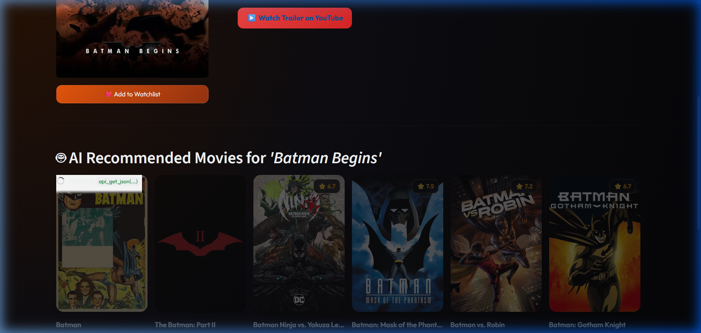
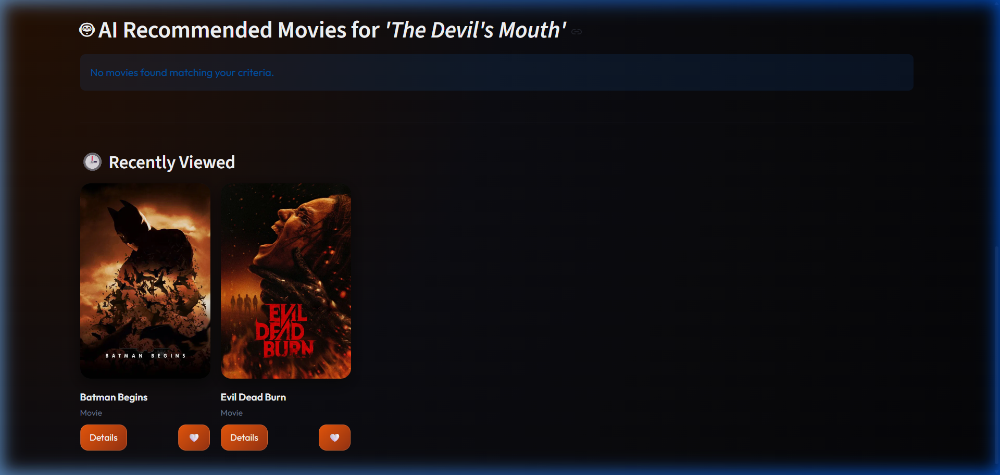
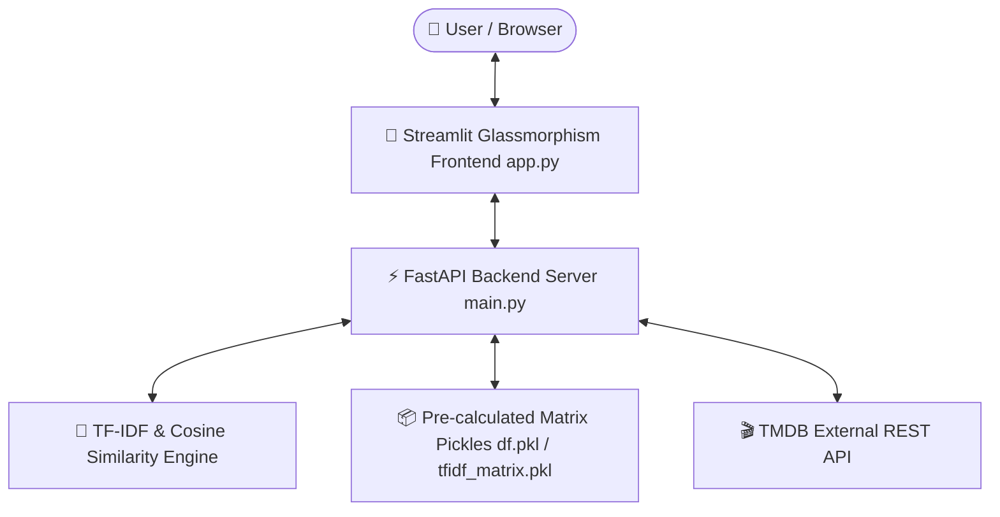

# 🎬 MovieVerse — AI-Powered Movie Recommendation System


> **MovieVerse** is a modern, full-stack AI movie recommendation web application. Powered by **TF-IDF & Cosine Similarity** algorithms on the backend, and styled with a sleek **Dark Glassmorphism UI** on the frontend, it delivers personalized movie suggestions, real-time TMDB metadata, high-resolution posters, trailers, and watchlist management.

---

## 🌟 Demo & Screenshots

### 🎯 AI Recommendations & Movie Details


### 🕒 Recently Viewed & Interactive Watchlist


---

## ✨ Features

- 🤖 **Content-Based ML Recommendation Engine**: Analyzes plot overviews, genres, keywords, and metadata using TF-IDF vectorization and Cosine Similarity.
- ⚡ **High-Performance FastAPI Backend**: Async REST API endpoints with interactive Swagger UI documentation at `/docs`.
- 🎨 **Modern Dark Glassmorphism UI**: Custom CSS design system built with Streamlit featuring vibrant orange accents, backdrop-blur card components, and smooth hover state animations.
- 🎬 **Rich TMDB API Integration**: High-resolution movie posters, vote ratings, release years, cast listings, and direct YouTube trailer embedding.
- 🔍 **Real-Time Search & Randomizer**: Instant movie search query bar and a "Pick Random!" discovery feature.
- 🕒 **Session History & Watchlist**: Keeps track of recently viewed movies and lets users add titles to a dynamic watchlist.

---

## 🏗️ Tech Stack & Architecture

### System Flowchart



### Stack Overview
- **Frontend**: Streamlit, Custom HTML/CSS Glassmorphism UI, Python
- **Backend**: FastAPI, Uvicorn, Pydantic, HTTPX (Async HTTP client)
- **Machine Learning / NLP**: Scikit-Learn (TF-IDF Vectorizer), Pandas, NumPy, Pickle
- **External API**: The Movie Database (TMDB) API v3

---

## 🚀 Quickstart Guide

### 1. Prerequisites
- Python `3.10` or higher
- Git
- Free TMDB API Key ([Get one here](https://www.themoviedb.org/settings/api))

### 2. Installation & Setup

```bash
# Clone the repository
git clone https://github.com/sharmashivam102006-arch/movie-recommendation-system.git
cd movie-recommendation-system

# Create and activate virtual environment
python -m venv .venv

# On Windows (PowerShell):
.\.venv\Scripts\Activate.ps1

# On Linux/macOS:
source .venv/bin/activate

# Install dependencies
pip install -r requirements.txt
```

### 3. Environment Configuration

Create a `.env` file in the root directory (or copy `.env.example`):

```bash
cp .env.example .env
```

Add your TMDB API Key to `.env`:
```env
TMDB_API_KEY=your_actual_tmdb_api_key_here
```

---

## 🏃 Running the Application

Launch both backend and frontend servers:

### 1️⃣ Start FastAPI Backend (Terminal 1)
```bash
uvicorn main:app --port 8000 --reload
```
> Backend API will be available at: **`http://localhost:8000`**  
> Interactive OpenAPI Docs: **`http://localhost:8000/docs`**

### 2️⃣ Start Streamlit Frontend (Terminal 2)
```bash
streamlit run app.py --server.port 8501
```
> Web Application will launch at: **`http://localhost:8501`**

---

## 🔌 API Endpoints Reference

| Method | Endpoint | Description |
| :--- | :--- | :--- |
| `GET` | `/` | Health check & API status |
| `GET` | `/recommend?title={title}&top_n=6` | Fetch top N AI movie recommendations for a given title |
| `GET` | `/search?q={query}` | Search movies by title in dataset |
| `GET` | `/random` | Fetch a random movie object |
| `GET` | `/movie/{tmdb_id}` | Fetch full TMDB metadata, cast, trailers & videos |

---

## 📁 Repository Structure

```
movie-recommendation-system/
├── assets/                  # Screenshot & demo media assets
│   ├── demo_recommendations.png
│   └── demo_recently_viewed.png
├── app.py                   # Streamlit Frontend Web App
├── main.py                  # FastAPI Backend API Server
├── df.pkl                   # Processed movies DataFrame pickle
├── indices.pkl              # Title-to-Index mapping dictionary
├── tfidf.pkl                # Trained TF-IDF Vectorizer model
├── tfidf_matrix.pkl         # Matrix of movie feature vectors
├── requirements.txt         # Python dependencies
├── .env.example             # Environment variables template
├── .gitignore               # Ignored files (.env, .venv, etc.)
└── README.md                # Project documentation
```

---

## 🤝 Contributing

Contributions, issues, and feature requests are welcome!  
Feel free to check the [Issues page](https://github.com/sharmashivam102006-arch/movie-recommendation-system/issues).

1. Fork the Project
2. Create your Feature Branch (`git checkout -b feature/AwesomeFeature`)
3. Commit your Changes (`git commit -m 'Add some AwesomeFeature'`)
4. Push to the Branch (`git push origin feature/AwesomeFeature`)
5. Open a Pull Request

---

## 📜 License

Distributed under the **MIT License**. See `LICENSE` for more information.

---

<p align="center">
  Crafted with ❤️ by <a href="https://github.com/sharmashivam102006-arch">Shivam Sharma</a>
</p>
